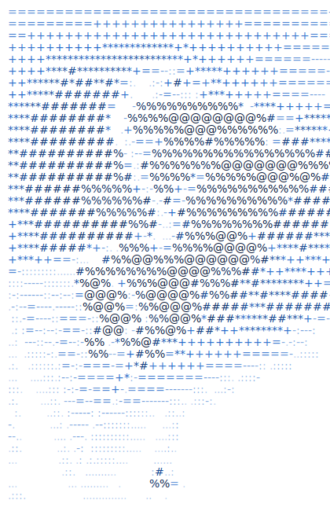

<div align="center">

<picture>
  <source media="(prefers-color-scheme: dark)" srcset="assets/dark.svg">
  
</picture>

<br>


</div>

<br>

```bash
umer@karachi:~$ whoami
```

**Syed Umer Ali** — Agentic AI Developer & Full-Stack Engineer based in Karachi, Pakistan.
I build autonomous AI agents, multi-agent pipelines, and automation systems using the OpenAI Agents SDK, FastMCP, Google ADK, n8n, and RAG pipelines.

Certified through **PIAIC · GIAIC · MCP · SMIT**

```bash
umer@karachi:~$ cat stack.json
```

<div align="center">


</div>

```bash
umer@karachi:~$ ls projects/
```

<div align="center">

<table>
<tr>
<td width="50%">

### 🤖 OmniTask Bot
Multi-agent automation system built with the OpenAI Agents SDK and FastMCP.

**[→ Live Demo](https://omni-task-bot.vercel.app)**

</td>
<td width="50%">

### 👟 Stride
3D animated shoe store with immersive scroll interactions and parallax depth.

**[→ Live Demo](https://stride-shoe-store.vercel.app)**

</td>
</tr>
</table>

</div>

```bash
umer@karachi:~$ ./show_stats.sh
```

<div align="center">

<picture>
  <source media="(prefers-color-scheme: dark)" srcset="https://github-readme-stats.vercel.app/api?username=Syed-Umer-Ali&show_icons=true&theme=dark&hide_border=true&bg_color=0D1117&title_color=1E90FF&icon_color=1E90FF&text_color=c9d1d9">
  
</picture>

<picture>
  <source media="(prefers-color-scheme: dark)" srcset="https://github-readme-streak-stats.herokuapp.com/?user=Syed-Umer-Ali&theme=dark&hide_border=true&background=0D1117&ring=1E90FF&fire=1E90FF&currStreakLabel=1E90FF">
  
</picture>

<picture>
  <source media="(prefers-color-scheme: dark)" srcset="https://github-readme-stats.vercel.app/api/top-langs/?username=Syed-Umer-Ali&layout=compact&theme=dark&hide_border=true&bg_color=0D1117&title_color=1E90FF&text_color=c9d1d9">
  
</picture>

</div>

```bash
umer@karachi:~$ cat connect.txt
```

<div align="center">

[](https://umerali-portfolio-website.vercel.app/)
[](https://linkedin.com/in/syed-umer-ali)
[](https://www.upwork.com/)

</div>

<div align="center">

`Digital FTEs` · `Multi-Agent Pipelines` · `Autonomous AI Systems` · `MCP Certified`

</div>
